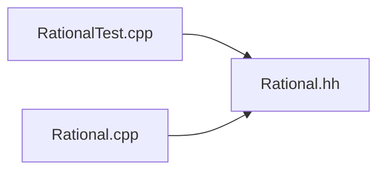

```toc
```


# `Rational.hh`
```cpp
// c++11
class Rational {
	public: // using declaration for name lookup
		using Int = long;
	private:
		Int num_;
		Int den_;
		
		void simplify();
	public:
		bool check_inv() const;
		
		Rational() 
			: Rational(0,1) {}00
		~Rational() = default; // destructor
		Rational(const Rational&) = default; // copy
		Rational(Rational&&) = default; // movement
		Rational& operator=(const Rational&) = default; // assign copy
		Rational& operator=(Rational&&) = default; // assign movement
		
		explicit Rational(Int n) 
			: Rational(n,1) {} // avoids implicit conversion
		Rational(Int n, Int d);
		
		const Int& num() const;
		const Int& den() const;
		
		Rational operator+(const Rational& a2) const;
		Rational operator-(const Rational& a2) const;
		Rational operator/(const Rational& a2) const;
		Rational operator*(const Rational& a2) const;
		
		Rational& operator+=(const Rational& a2);
		Rational& operator-=(const Rational& a2);
		Rational& operator/=(const Rational& a2);
		Rational& operator*=(const Rational& a2);
		
		Rational& operator == 
		
		Rational operator-() const;
		Rational operator+() const;
		
		Rational& operator++();
		Rational operator++(int); // post-increment
		
		Rational& operator--();
		Rational operator--(int);
		
		bool operator==(const Rational& a2) const { // class invariance
			return num_ == a2.num_ && den_ == a2.den_;
		}
		
		bool operator!=(const Rational& a2) const;
		bool operator<(const Rational& a2) const;
		bool operator<=(const Rational& a2) const;
		bool operator>(const Rational& a2) const;
		bool operator>=(const Rational& a2) const;
		
		void print(std::ostream& os) const;
}; // class Ration

inline std::ostream& operator<<(std::ostream& os,const Rational& r) {
	r.print(os);
	return os;
}
```

# `Rational.cpp`
```cpp
#include "Rational.hh"
#include <numeric>
#include <cassert>

namespace Numeric {
	bool Rational::check_inv() const {
		if(num_ == 0)
			return den_ == 1;
		if(den_ <= 0)
			return false;
		if(std::gcd(num_,den_) != 1)
			return false;
		// invariant here is satisfied
		return true;
	}
	
	void Rational::simplify() {
		assert(den_ > 0);
		Int gcd = std::gcd(num_, den_);
		if(gcd != 1) {
			num_ /= gcd;
			den_ /= gcd;
		}
	}
	
	Rational::Rational(const Int& num, const Int& den) 
		: num_(num), den_(den) {
		assert(den != 0);
		
		if(num_ == 0) {
			den_ = 1;
			assert(check_inv());
			return;
		}
		if(den_ < 0) {
			num_ = -num_;
			den_ = -den_;
		}
		Int gcd = std::gcd(num_,den_);
		if(gcd != 1) {
			num_ /= gcd;
			den_ /= gcd;
		}
		assert(check_inv());
	}
}
```